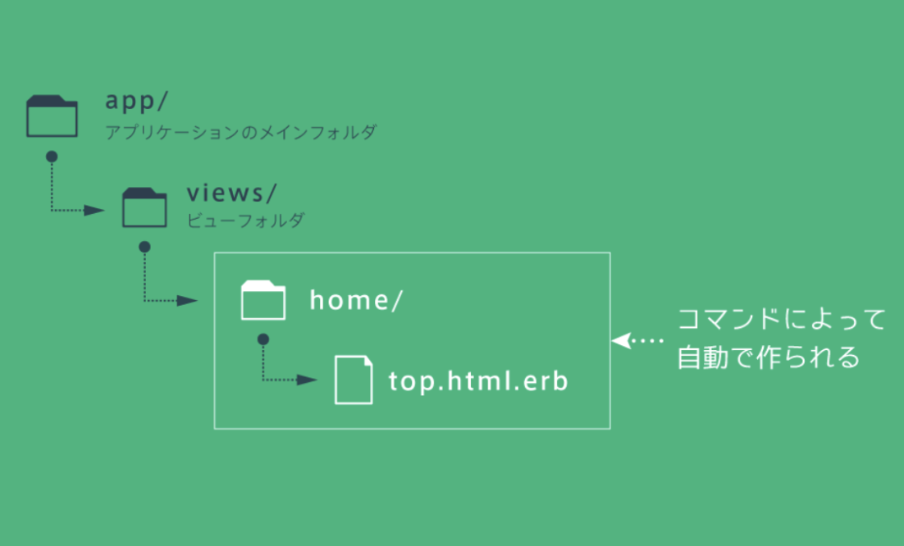
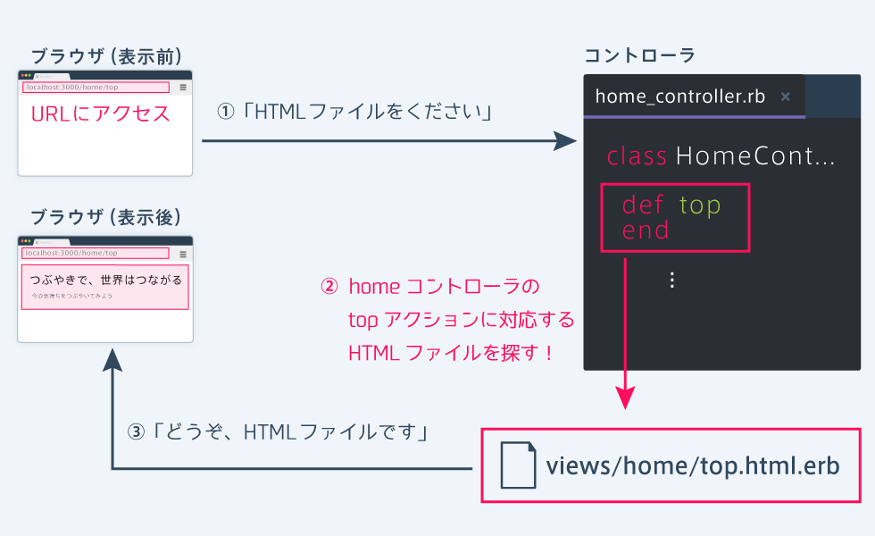
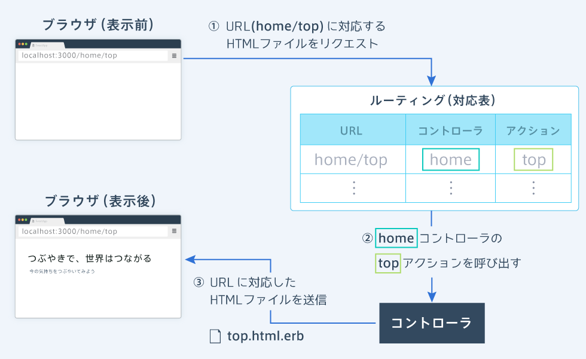
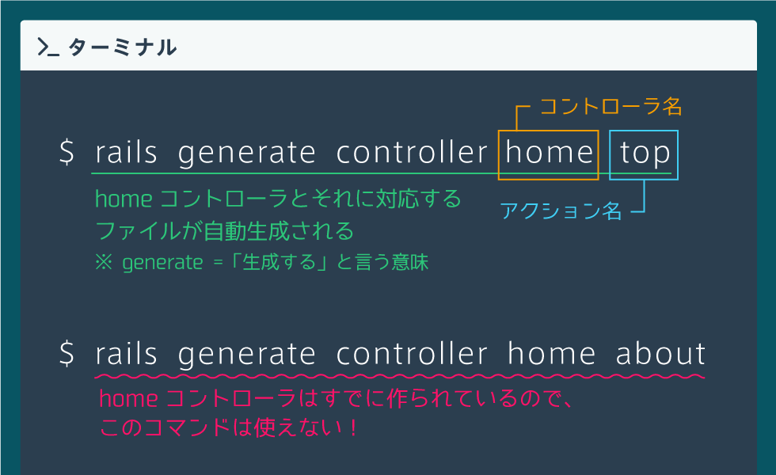
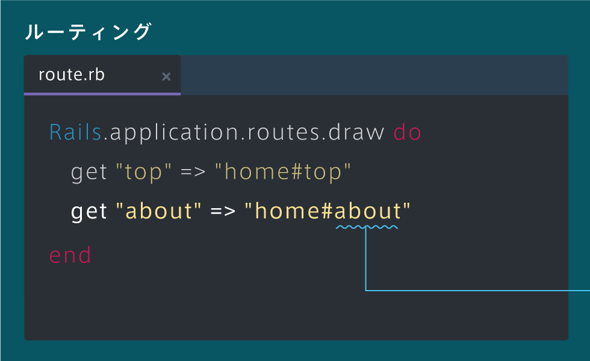
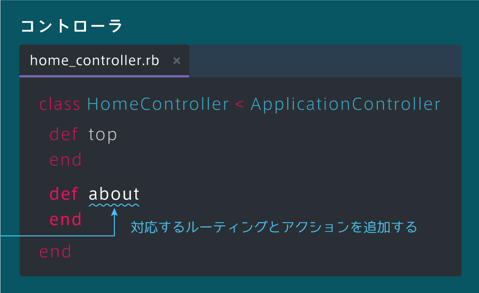

# Ruby on Rails5 学習コース Ⅰ
## railsアプリケーションの準備
> rails new tweet_app

railsで開発を始めるときは、上記の「rails new app名」というコマンドをターミナルで実行する<br>
このコマンドを実行することで、入力したapp名と同名のフォルダが作成され、その中に開発に必要なフォルダやファイルが用意される

## サーバーを立ち上げる
> rails server

ローカルホストのサーバを起動するための、上記のコマンドを実行する。<br>
サーバを起動したあと、ブラウザで「localhost:3000」というURLにアクセスすると、railsの画面が表示される。

## トップページを自動生成してみよう
> rails generate controller home top

トップページを作成するためには、上記のコマンドを実行する。<br>
このコマンドを実行すると、新しいwebページが自動で作成され、「localhost:3000/home/top」というURLにアクセスできるようになる。

## ページに必要なもの
* ビュー
* コントローラ
* ルーティング

### ビュー
ページの「見た目」を作るためのHTMLファイルのことである。<br>
ビューはviewsフォルダの中に配置される。<br>
「rails generate controller home top」を実行すると、viewsフォルダの中に「homeフォルダ」と「top.html.erb」というファイルが作成されます。


### コントローラ
ページを表示するとき、Railsの中ではコントローラを経由してビューをブラウザに返す。<br>
「rails generate controller home top」を実行すると、「home_controller.rb」というコントローラのファイルが作成され、ファイルの中に「topメソッド」が追加される。<br>
コントローラ内のメソッドを「アクション」と呼ぶ。
```ruby
class HomeController < ApplicationController
  # アクション
  def top
  end
end 
```
コントローラ内のアクションは、ブラウザに返すビューをviewフォルダないから見つけ出す役割を担っている。<br>
具体的には、アクションは、<b>コントローラと同じ名前のビューフォルダ</b>から、<b>アクションと同じ名前のHTMLファイル</b>を探してブラウザに返す。

todo: topメソッドをコメントアウトしても何も変わらなかったけどなんでか調べる

### ルーティング
Rails内ではコントローラを経由してビューを返していますが、ブラウザとコントローラを繋ぐ役割を担うのがルーティングである<br>
ページが表示されるまでに、ルーティング→コントローラ→ビューという順で処理が行われていることを理解しておこう。<br>
ルーティングは、送信されたURLに対して「どのコントローラの、
どのアクション」で処理するかを決める「対応表」のことである。<br>
ブラウザでURLを入力すると、ルーティングがURLを見て、適切なコントローラのアクションを呼び出す。


ルーティングは「config/routes.rb」に定義され、「get "URL" => "コントローラー名#アクション名"」という文法で書かれる。<br>
これによって、ブラウザから「localhost:3000/home/top」というURLが送信されたときに、homeコントローラーのtopアクションで処理されるようになる。
```ruby
Rails.application.routes.draw do
  get "home/top" => "home#top"
end
```

### コマンドの意味を理解しよう
トップページを作るときに入力したコマンドには、実は「コントローラ名」と「アクション名」が含まれている。<br>
「rails generate controller コントローラ名 アクション名」を実行することで、コントローラと、それに対応したファイルが自動で用意される。 <br>
しかし、同じ名前のコントローラがすでにある場合は、このコマンドを使うことはできない。


### ルーティングとアクションを追加しよう
すでに作られているルーティングとコントローラのファイルにコードを書き足すことで、ルーティングとアクションを追加できます。


