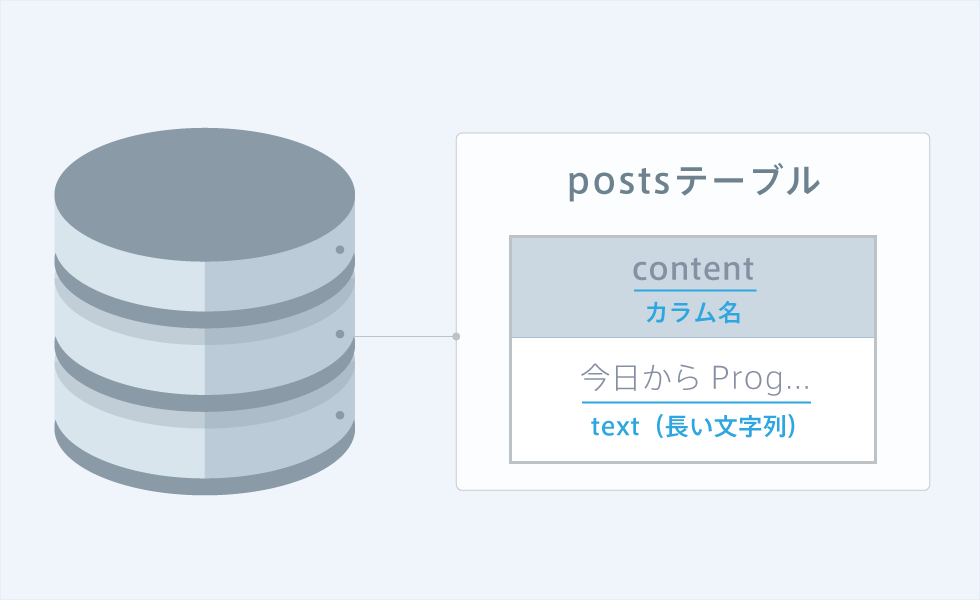
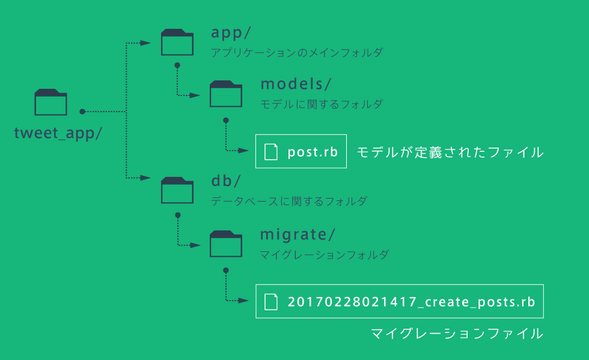

# Ruby on Rails5 学習コース Ⅱ

## postsControllerを作成する
今回は、投稿に関するページを作成するため、postsControllerを作成する。<br>
homeコントローラでも作成することができるが、投稿に関することは投稿に関するコントローラを作成したほうがよい。<br>
一覧ページを作成する時は、indexというアクション名を使用することが一般的なので、indexアクションを用意する。<br>
今回は新しくpostsコントローラを作成するので、「rails g controller posts index」を実行する。<br>
「rails generate controller」は「rails g controller」と省略可。

## viewファイル内で変数を定義する
index.html.erbのようなerbという形式のファイルでは、<% %>で囲むことで、HTMLファイルの中にRubyのコードを記述することができる。<br>
「erb」とは「Embedded Ruby（埋め込みRuby）」の略。
```html
<!-- Rubyのコード -->
<% post1 = "今日からProgateでRails" %>
<% post2 = "投稿一覧ページ作成中!" %>

<div class="posts-index">
<div>
```
埋め込むRubyコードをブラウザに表示したい場合には、以下のように<% %>ではなく、<%= %>を用います。
```html
<% post1 = "今日からProgateでRails" %>

<%= post1 %>
```

## each文でHTMLを配列の数分表示する
```html
<%
  posts = [
    "今日から始めるRails",
    "投稿一覧ページ作成中!"
  ]
%>

<!-- 投稿の数だけHTMLを書く必要がなくなる -->
<% posts.each do |post| %>
  <div class="posts-index-item">
    <%= post %>
  </div>
<% end %>
```
## アクションで変数を定義する
Railsではビューファイル内ではなく、アクションで定義するのが一般的であるため、アクションでの定義の仕方を学習する。
```ruby
def index 
  # ビューで使う変数をアクションに定義する
  @posts = [
    "今日からProgateでRails",
    "投稿一覧ページ作成中!"
  ]
end
```

## @変数
通常、アクションで定義した変数をビューで使用することはできないが、変数名を「@」から始めることでこの変数は特殊な変数となり、ビューファイルでも使用することが可能となる。<br>
アクションで定義したビュー用の変数には「@」をつけ忘れないように!
```ruby
class PostsControlloer < ApplicationController
  def index 
    @post1 = "にんじゃわんこ" # ビューで使える
    post2 = "ひつじ仙人" # ビューで使えない
  end
end
```
## テーブル作成の準備
データベースに変更の指示をするための<b>マイグレーションファイル</b>を作成する。<br>
下図のようなpostsテーブルを作成するマイグレーションファイルは「rails g model Post content:text」コマンドで作成する。<br>
また、「text」は「長い文字列」を意味しており、contentカラムにどのようなデータが入るかを意味している。<br>
コマンドを実行すると、db/migrateフォルダの下にマイグレーションファイルが作成されます。

先ほど作成したマイグレーションファイルを用い、データベースに変更を反映するために、「rails db:migrate」コマンドを実行する必要がある。<br>
このコマンドを実行することで、マイグレーションファイルに書いてある指示通りにデータベースが作成される。<br>
「rails g model」コマンドによって、Postモデルが定義されたファイル「post.rb」が、app/modelsフォルダの中に作成されている。<br>
ファイルの中には、ApplicationRecordクラスを継承するPostクラスが定義されており、このようにApplicationRecordを継承したクラスをモデルと呼ぶ。

## rails g modelコマンドまとめ
「rails g model Post...」のPostの部分には、実はモデル名を指定する。そして、このコマンドを実行することにより、以下の2つのファイルが生成される。

```ruby
rails g model Post content:text
           # モデル名 カラム名 データ型
```

## rails console
