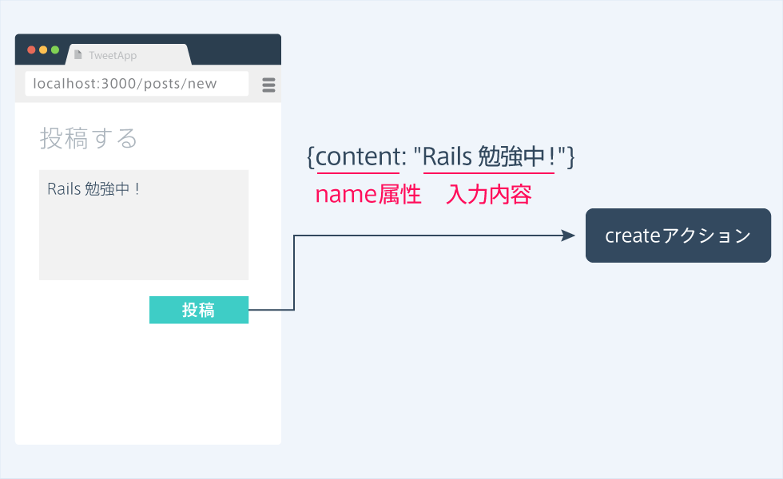
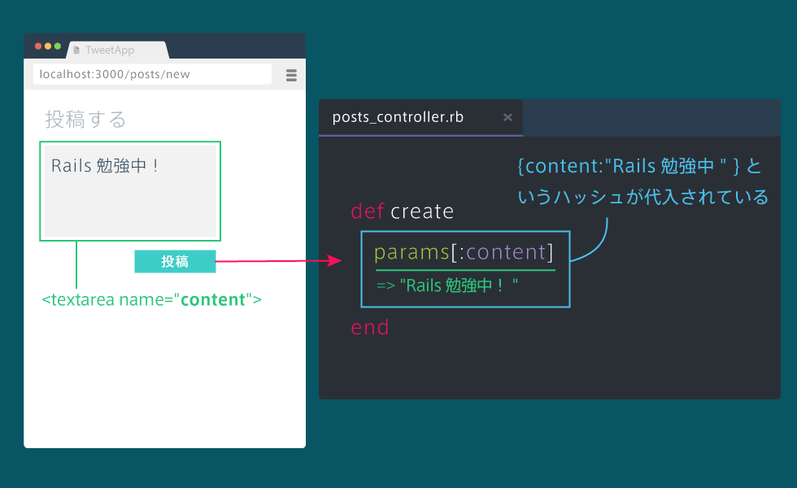

# Ruby on Rails5 学習コース Ⅲ

## 自動生成されるカラム
### idカラム
データベースに保存される時、数字が自動で入る。<br>
idは1から順に入っていき、データごとに重複しないようになっている。

### created_atカラムとupdated_atカラム
データベースに保存された時刻が自動で入る。<br>
updated_atはデータ更新時にも時刻が更新される。

## find_byメソッドで投稿を取得する
特定のidの投稿を取得するために用いる。<br>
find_byメソッドは、ある条件に合致するデータを取得することができる。<br>
「モデル名.find_by(カラム名: 値)」とすることで、その値を持ったデータをデータベースから取得することができる。
```ruby
post = Post.find_by(id:3)
puts post.content # postsテーブルの3番目のcontentが出力される
```

## URLにidを含める
ルーティングのURL部分に「:」を用いて「posts/:id」と指定することで、「/posts/1」でも「/posts/2」でもshowアクションにいくようになる。
「posts/:id」と書くと「/posts/◯◯」のような全てのURLが該当する。
(メリット)これをしないと新規データが作られた時、ルーティングも新たに作成しなければならなく、冗長だから
```ruby
get "posts/:id" => "posts#show"
```

## URLからidを取得する
コントローラのアクション内では、ルーティングで設定したURLの「:id」の値を取得することができる。<br>
その値はparamsという変数にハッシュとして入っており、params[:id]とすることで、その値を取得することができる。
```ruby
def show
  @id = params[:id] # {id: 1}というハッシュがparamsに入っている
end
```

## 詳細画面に投稿を表示する
```ruby
def show 
  @post = Post.find_by(id: params[:id]) # idカラムがparams[:id]である投稿データを取得している
end
```
## 詳細ページへのリンクを作る
各投稿の内容の部分をクリックすると詳細ページに移動できるように、link_to(post.content, "/posts/#{post.id}")とする。
```html
<% @posts.each do |post| %>
  <div class="posts-index-item">
    <%= link_to(post.content, "/posts/#{post.id}") %>
  </div>
<% end %>
```

## 投稿内容を受け取るアクションを作成する
今までルーティングを書く際に「get」と書いてきたが、フォームの値を受け取る場合は「post」とする必要がある。この「post」はPostモデルの「Post」とは関係ない。）<br>
通常は「get」、フォームの値を受け取るときは「post」というように覚える。
```ruby
post "posts/create" => "posts#create" # フォームの値を受け取るため、postとする
```
form_tagメソッドを用いると、フォームに入力されたデータを送信することができる。<br>
form_tagは、「form_tag(送信先のURL) do」のように送信先のURLを指定します。<br>
これによって、<input type="submit" ...>のボタンを押した時に、指定されたURLにデータが送信される。
```html
<%= form_tag("/posts/create") do %>
  <textarea></textarea>
  <input type="submit" value="投稿>
<% end %>
```

## 投稿一覧ページに転送する
他のURLに転送するには、redirect_toメソッドを用いる｡<br>
redirect_toは「redirect_to(URL)」とすることで、URLのページに転送することができる。
```ruby
def create 
  redirect_to("/posts/index") # 指定したURLに転送する
end
```

##  投稿を保存する
### name属性
現状のフォームでは、投稿ボタンを押しても入力した内容をcreateアクションに伝えることができない。<br>
textareaタグにname属性を指定すると、入力データを送信できるようになり、name属性の値をキーとしたハッシュがrails側に送られる。
```html
<!-- 入力データを送信できるようになる -->
<textarea name="content"></textarea> 
```


### フォームに入力されたデータを受け取る
name属性を指定したフォームに入力したデータは、コントローラのアクション内で受け取ることが可能になる。<br>
フォームのデータは、変数paramsで受け取る。<br>
paramsはname属性に設定した文字列をキーとしたハッシュになっている。


### データベースに投稿を保存する
```ruby
def create 
  @post = Post.new(content: params[:content]) # contentが入力データであるインスタンスを作成している
  @post.save
  reject_to("/posts/index")
end
```

## 投稿を並び替える
### orderメソッド
order(カラム名: 並び替えの順序）のように使い、投稿一覧を並び替えることができる。<br>
並び替えの順序には、昇順（:asc）と降順（:desc）のどちらかを指定できる。<br>
created_atを基準に降順（:desc）に並べ替えると、新しいものから順番に表示するようになる。
```ruby
def index 
  @posts = Post.all.order(created_at: :desc)
end
```