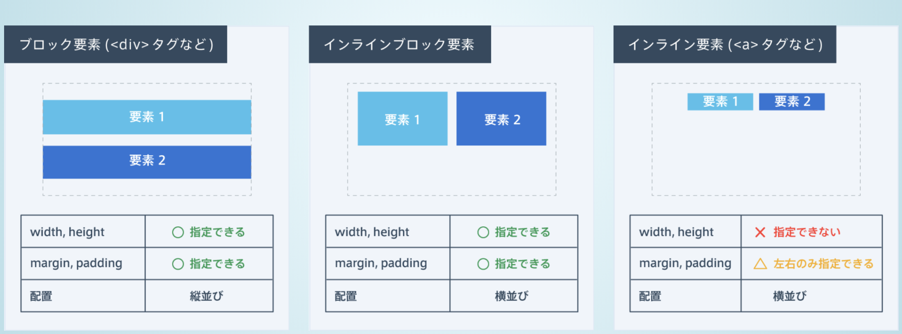
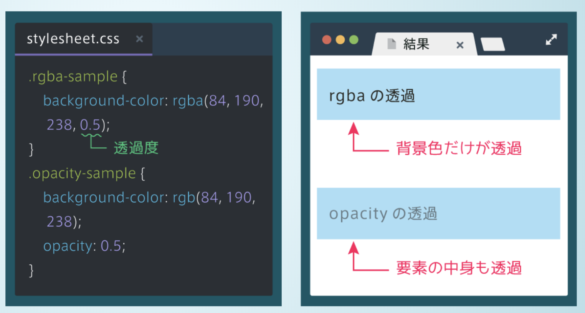
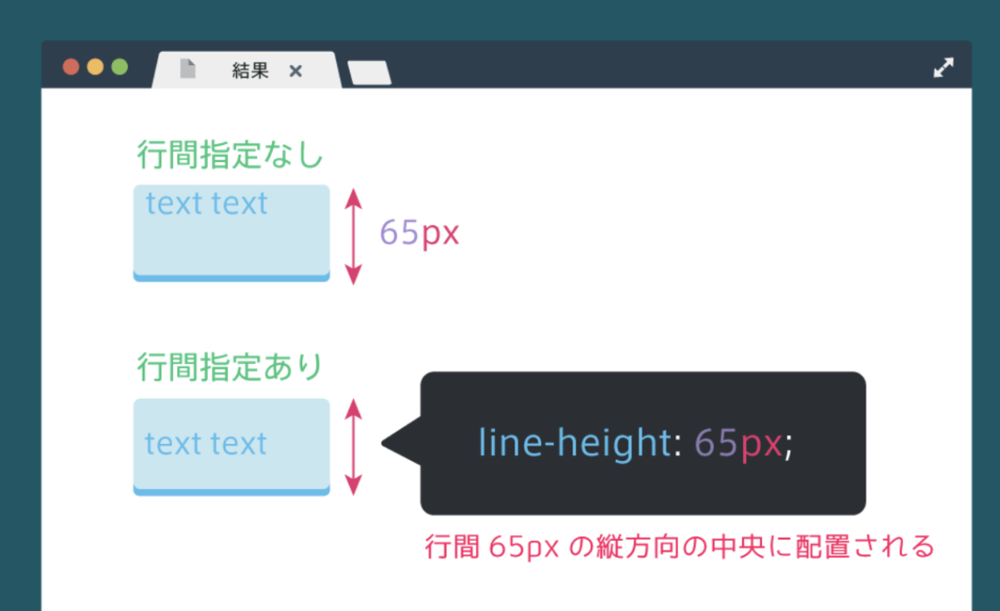
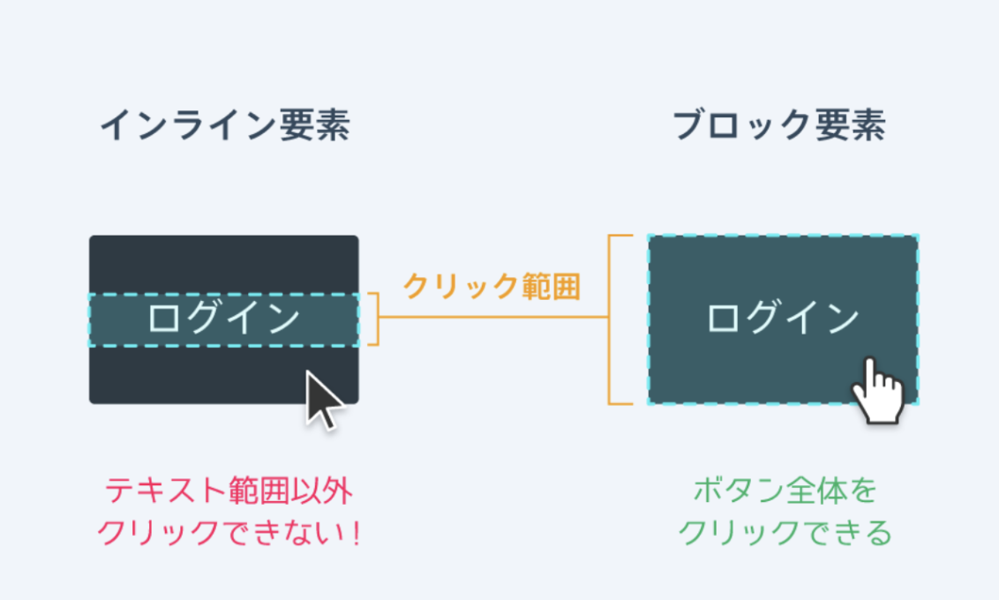

# htmlcss学習メモ

## 初知り
### 背景画像設定
background-image: url(画像のURL);

### background-size
background-imageで指定された背景画像は図のように表示範囲を埋め尽くすまで、繰り返し表示される性質がある。<br>
background-size: cover;を指定すると、1枚の画像で表示範囲を埋め尽くすように画像の大きさが拡大縮小する。<br>

### 部品の中央揃え
中央に寄せるためにはmarginの左右にautoを指定します。<br>
marginにautoを指定するときは、必ずwidthを併せて指定します。<br>
なお、上下のmarginにautoを指定することはできません。<br>
```css
.box {
    width: 300px
    margin: 0 auto;
}
```
### 文字の間隔を開ける
```css
letter-spacing: 2px
```

### ボタンの作成
ボタンを作っていきます。ボタンはaタグで指定します。<br>
しかしaタグはインライン要素であり、インライン要素にはwidthやheightが指定できないなど不便な点があります。<br>
ブロック要素とインライン要素の特徴を併せ持つ<b>インラインブロック要素</b>というものがあります。<br>
インラインブロック要素はインライン要素と同様に横に並びますが、ブロック要素のように幅や高さをもちます。<br>


aタグは初期状態でインライン要素になっていますが、displayプロパティを使うと、インラインブロック要素に変更することができます。<br>
displayプロパティはblock（ブロック要素）, inline-block（インラインブロック要素）, inline（インライン要素）を指定することができます。

### 複数クラスの指定
ボタンのように、「共通の部分があるが、それぞれ小さい変化をつけたいとき」にはクラスの名前を複数指定すると便利です。<br>
下図のように、半角スペースで区切って複数のクラスを指定することができます。


### カーソルが乗った時
カーソルが乗ったときの状態をhoverと言います。<br>
CSSで、セレクタ:hoverとすることで、カーソルが乗ったときのCSSを指定することができます。
```css
div :hover {
    background-color: red;
}
```

### 角を丸くする
border-radiusプロパティを用います。<br>
数字が大きいほど角が丸くなります。
```css
border-radius: 10px
```

### 文字を寄せる
text-alignプロパティを用いることで、テキスト等のインライン要素やインラインブロック要素の配置を指定することができます。<br>
leftで左寄せ、centerで中央揃え、rightで右寄せに設定することができます。
```css
text-align: left;   // 左揃え
text-align: center; // 中央揃え
text-align: right;  // 右揃え
```

### 「margin0 auto」 と「text-align: center」の違い
* containerクラスのように、広い範囲を囲うようなブロック要素の場合はmargin
* テキストやボタンのようなインライン要素・インラインブロック要素の場合はtext-align

### アイコンを表示するにはFont Awesomeというものを使うと便利
Font Awesomeは、以下の手順で使用することができます。
1. Font AwesomeのCSSファイルを読み込む
2. spanタグにfaクラスとfa-アイコン名クラスを指定する（Font Awesomeのサイトにアイコンごとのクラス名が載っています。）
3. これだけで簡単にアイコンを表示させることができます。
[FontAwesome](https://fontawesome.com/?utm_source=font_awesome_homepage&utm_medium=display&utm_campaign=fa5_released&utm_content=auto_modal)

### opacityとrgba
opacityには要素の中身全てを透明にするという性質があります。<br>
背景色のみを透明にするには、rgbaというものを使う必要があります。<br>
rgbaは4つの値をコンマ（,）区切りで入れます。<br>
4つ目の値が透明にする度合いで、0 ~ 1の数値で指定します（値が小さいほど透明になります）。<br>
opacityプロパティは要素全体を透過させますが、rgbaを使うとその色だけを透明にすることが出来ます。


### transition
transitionを使うとアニメーションをつけることができます。<br>
「変化の対象」や、「変化にかかる時間」などを指定できます。<br>
「変化の対象」にはcolorなどのプロパティを指定しますが、allを指定すると全てのプロパティに適用出来ます。<br>
transitionは多くの場合hoverと組み合わせて使います。<br>

### line-height
line-heightプロパティを使うと、行の高さを指定することができます。<br>
値が大きいほど行間が大きくなります。<br>
line-heightプロパティは本来行間を調整するためのプロパティですが、要素の縦方向の中央に文字を配置するのにも使えます。<br>
line-heightプロパティの「高さの中心」に文字が配置されるため、要素の高さとline-heightプロパティを同じ値にすると、文字がちょうど中央に配置されるようになります。<br>


### aタグのクリックできる範囲変更
aタグはインライン要素なので、中身のテキストの部分しか大きさを持ちません。<br>
その結果、aタグをクリックできる範囲はテキストの部分だけになってしまいます。<br>
aタグをブロック要素にすると、大きさが親要素いっぱいに広がるので、全体をクリックできるようになります。


### 画面に要素を固定する
position: fixed;を使うと、常に要素を画面上の指定した位置に固定させておくことができます。<br>
位置は、top、left、right、bottomを使って指定します。<br>
```css
.fixed-img {
    position: fixed;
    top: 10px;
    left: 40px;
}
```